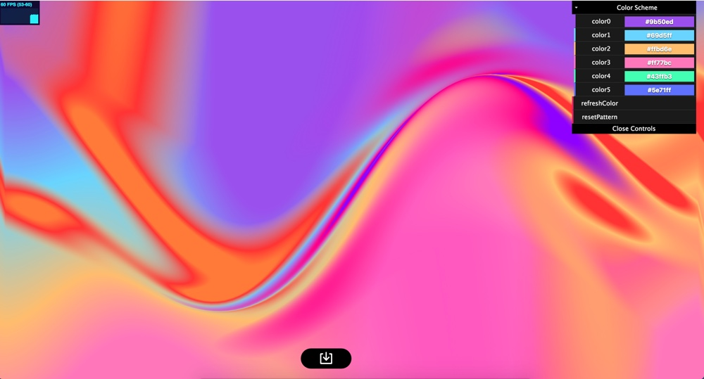
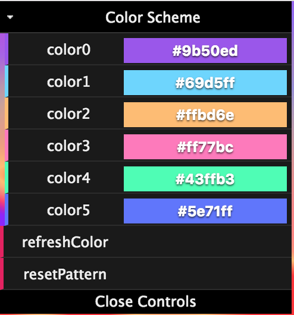

# Introduction
Color Painter is a tool for building wonderful color gradients on webpage.  
It based on Three.js, and you can change the color scheme to whatever colors you like.


# How to setup it 
After download or clone the whole project, you don't need to install anything to run it. I recommond you to open a local server like:

``` python -m SimpleHTTPServer 8000```

and then enter into the main path, you'll see the interface as this:




# How to use it
With the control panel on the right top corner, you can do some basic modification with ColorPainter:



just select some color and click 'refreshColor' button, then you can have the color scheme changed.

# How to keep the picture

With the download button in the bottom of the page, you can download the image and use it anywhere you need.

